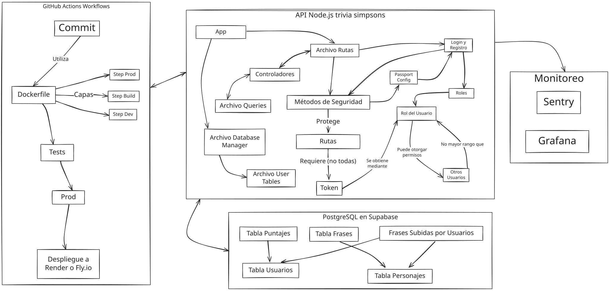
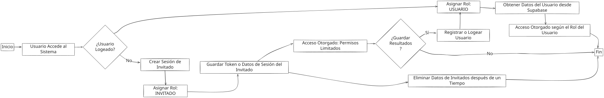
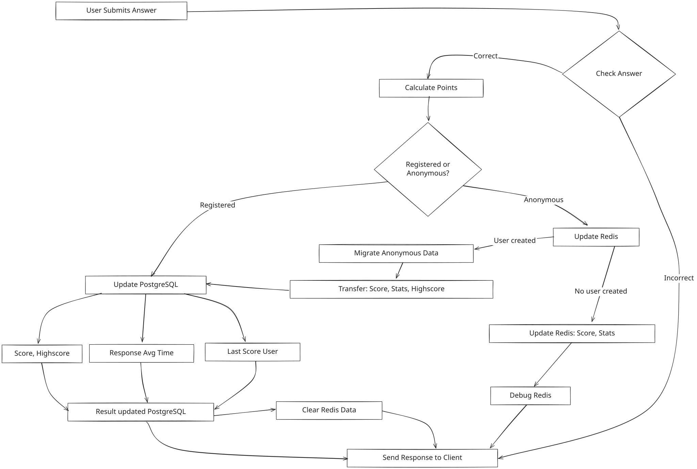
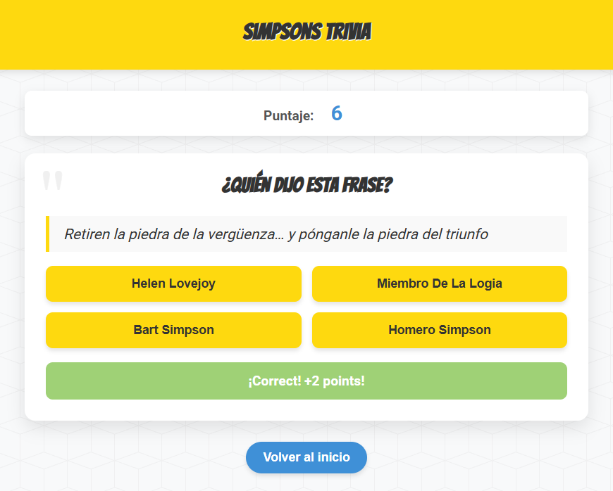
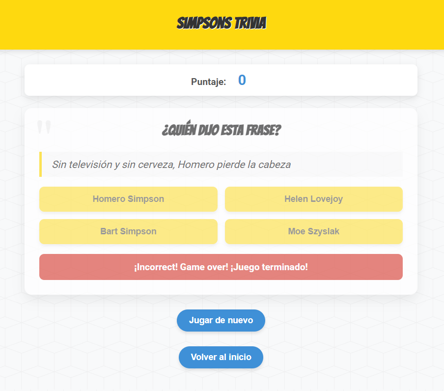
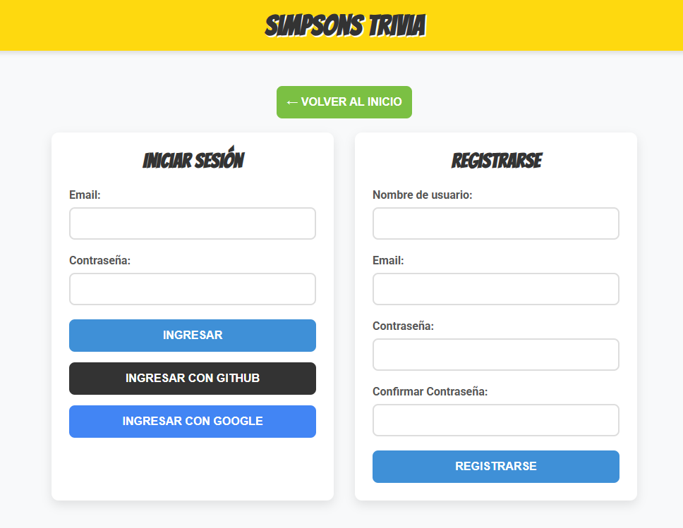
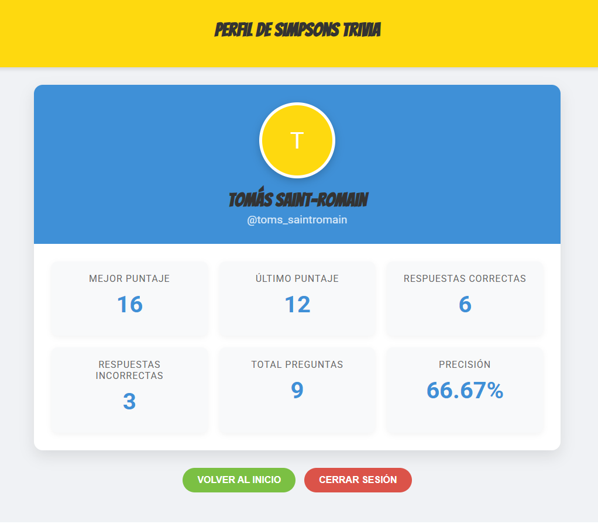

<div align="center">

# Trivia Simpsons ES latam 🍩

[](https://nodejs.org/)
[](https://www.npmjs.com/)
[](https://www.nodemon.io/)
[](https://www.npmjs.com/)
[](https://expressjs.com/)
[](https://eslint.org/)
[](https://nodejs.org/)
[](https://upstash.com/)

[](https://docs.github.com/en/actions)
[](https://supabase.com/)
[](https://render.com/)
[](https://Fly.io/)
[](https://docker.com/)
[](https://sentry.io/)
[](https://grafana.com/)


</div>

<div align="center"></div>

<div align= "center" >

### Este proyecto es un trabajo universitario presentado en la materia DevOps de la universidad de palermo.

</div>

# 🤓 Objetivo

### Implementar diferentes herramientas en un proyecto que contemple el correcto funcionamiento del servicio, el cual sea alojado en la nube.

### Esto nos va a servir para poder controlar y verificar el funcionamiento del mismo asi como tambien analizar las metricas, los testeos, manejo de CI/CD, creacion y configuracion de archivos docker.

# 🚀 **Características Destacadas**

<div align="center">

### 🎮 **Trivia Interactiva Completa** | 👤 **Sistema de Usuarios Avanzado** | 🔗 **OAuth Multi-Proveedor**

**Juega la trivia más divertida de Los Simpsons con autenticación moderna y gestión completa de usuarios**

</div>

## 🔑 Acceso a la API - 

### 🌐 **Demo en Vivo**
Podes acceder a la aplicación completa a través del siguiente [**🔗 LINK**](https://simpsons-trivia.fly.dev/)

### 📚 **Documentación API**
Explora todos los endpoints disponibles en la [**📖 Documentación Swagger**](https://simpsons-trivia.fly.dev/api/v1/) integrada.

# 🙋‍♂️ Preguntas y Respuestas

<details><summary><h2>De que trata el proyecto? 🤔</h2></summary>

### El proyecto contempla la creacion de una trivia usando frases de los simpsons, la idea es adivinar la mayor cantidad de personajes en base a las frases brindadas en cada ronda.

### El mismo cuenta con una base de datos que almacena la informacion de los jugadores/participantes.

</details>

<details close><summary><h2>Stack Tecnológico 🛠️</h2></summary>

### 🖥️ **Backend & Core**
- **Runtime:** Node.js v22.9.0
- **Framework:** Express.js v4.20.0
- **Language:** JavaScript (CommonJS)
- **Package Manager:** NPM v10.1.0

### 🗄️ **Base de Datos & Storage**
- **Principal:** PostgreSQL (via Supabase)
- **Cache:** Redis (Upstash/Local)
- **Storage:** Supabase Storage (imágenes de perfil)
- **ORM:** Queries SQL nativas

### 🔐 **Autenticación & Seguridad**
- **Auth Provider:** Supabase Auth
- **OAuth:** Google, GitHub
- **Tokens:** JWT con refresh automático
- **Security:** bcryptjs, express-rate-limit, express-brute
- **CORS:** Configuración personalizada

### 🧪 **Testing & Quality**
- **Testing:** Jest v29.7.0
- **Linting:** ESLint v9.11.1
- **Load Testing:** JMeter v5.6.3
- **Code Quality:** Pre-commit hooks

### 🚀 **DevOps & Deployment**
- **Containerización:** Docker (multi-stage)
- **CI/CD:** GitHub Actions
- **Hosting:** Fly.io (principal), Render (alternativo)
- **Monitoring:** Sentry, Grafana
- **Docs:** Swagger UI + YAML

### 🖥️ **Frontend & UI**
- **Engine:** EJS Templates
- **Styling:** CSS3 con Variables Customizadas
- **Icons:** Emoji + Provider Favicons
- **Animations:** CSS Transitions & Keyframes

### 🔧 **Development Tools**
- **Dev Server:** Nodemon v3.1.4
- **Process Manager:** PM2 (producción)
- **Environment:** Variables de entorno centralizadas
- **Debugging:** Console logs + Sentry tracking

</details>

<details close><summary><h2>Funcionalidades 🚥</h2></summary>

### 🎮 **Características Principales**
- [x] Consultar frases iconicas y famosas de la serie
- [x] Acceder a los diferentes endpoints
- [x] Consultar todos los personajes
- [x] Consultar que frase pertenece a que personaje
- [x] Consultar el estado de la api en health check
- [x] **Trivia completa funcional** - Juego interactivo con puntuación
- [x] **Sistema de ranking** - Mejor puntaje, último puntaje y estadísticas

### 👤 **Sistema de Usuarios**
- [x] **Registro y login tradicional** - Email/contraseña
- [x] **Autenticación OAuth** - Google y GitHub
- [x] **Vinculación de cuentas** - Conecta múltiples proveedores OAuth
- [x] **Usuarios anónimos** - Juega sin registrarte
- [x] **Gestión de sesiones** - Tokens JWT con refresh automático
- [x] **Perfiles de usuario** - Estadísticas personalizadas y gestión de cuenta

### 🔐 **Seguridad y Administración**
- [x] **Roles de usuario** - Sistema de permisos (Admin/User/Guest)
- [x] **Rate limiting** - Protección contra abuso de API
- [x] **Brute force protection** - Seguridad en login
- [x] **Eliminación automática** - Limpieza de usuarios temporales

### 📊 **Características Técnicas**
- [x] **Base de datos dual** - PostgreSQL + Redis para rendimiento
- [x] **Monitoreo con Sentry** - Tracking de errores en tiempo real
- [x] **CI/CD automatizado** - GitHub Actions para deploy
- [x] **Documentación API** - Swagger integrado
- [x] **Containerización** - Docker multi-stage para dev/prod

### 🎯 **Pendientes**
- [ ] Consultar a que capitulo/temporada pertenece la frase
- [ ] Sistema de recompensas con imágenes de perfil
- [ ] Cache Redis para preguntas frecuentes
- [ ] Integración con IA para generar contenido

</details>

<details close><summary><h2>Quienes participaron? 👨‍💻</h2></summary>

- #### Back end: Tomás Saint Romain

- #### Front end: 👀

</details>

# 📖 Documentación

###### Por mas que parezca tentador por favor no se coma la documentacion 🤤

## 🚀 **Inicio Rápido**

### 1️⃣ **Clonar el repositorio**
``` bash
git clone https://github.com/TomasS-R/SimpsonsTrivia
cd SimpsonsTrivia
```

### 2️⃣ **Instalar dependencias**
``` bash 
npm install
```

### 3️⃣ **Configurar variables de entorno**
``` bash
# Copia el template y configura tus variables
cp .env.template .env
# Edita .env con tus configuraciones
```

### 4️⃣ **Ejecutar en desarrollo**
``` bash
# Opción 1: Con testing automático
npm run dev

# Opción 2: Solo servidor
npm start

# Opción 3: Modo manual
nodemon --env-file=.env src/app.js
```

### 5️⃣ **Verificar funcionamiento**
- 🌐 **App:** http://localhost:3000
- 📚 **API Docs:** http://localhost:3000/api/v1
- 🧪 **Health Check:** http://localhost:3000/api/v1/healthcheck

### 🧪 **Testing & Quality**
``` bash
# Ejecutar tests
npm test

# Verificar código
npm run lint

# Ambos (usado en npm run dev)
npm test && npm run lint
```

## Variables de entorno 💡

<summary><h3>Base de datos</h3></summary>

> [!IMPORTANT]
> Al correr este proyecto puedes agregar las siguientes variables de entorno al archivo .env (debes crear este archivo, o cambiarle el nombre al archivo .env.template) ya sea que lo corras de forma local o en la nube ☁️ si completas los campos debes cambiar la variable `CONNECTPOSTGRES` y colocarla en `True` ya que si no, no tomara las variables de la Base de datos.

Variables de entorno para la conexion con postgress

| Nombre | Valor default | Descripcion |
| - | - | - |
| DATABASEUSER | - | Campo usuario de la base de datos |
| DATABASEPASS | Tu constraseña | La contraseña de la base de datos |
| DATABASEHOST| - | El host que te provee la base de datos|
| DATABASEPORT| - | El puerto que te provee|
| DATABASENAME| postgress | El nombre que te provee|

<summary><h3>Puerto</h3> <h5>(donde correra la aplicacion)</h5></summary>

> [!NOTE]
> Por defecto si no tiene valor correra en el puerto 3000

`PORT=`

<summary><h3>Host</h3> <h5>(donde se aloja la aplicacion)</h5></summary>

> [!NOTE]
> Por defecto tiene 'localhost:' debes cambiarlo al subirlo a la nube o puedes dejarlo vacio como en mi caso

`HOST`

<summary><h3>JWT</h3> <h5>(Seguridad login)</h5></summary>

> [!NOTE]
> JWT_SECRET es para generar un json web token este lo debes generar tu mismo, puedes combinar letras y numeros o usar un generador de contraseñas

`JWT_SECRET=`

<summary><h3>CONNECTPOSTGRES</h3> <h5>(conexion a base de datos)</h5></summary>

> [!NOTE]
> Por defecto si no tiene valor asignado esta en `False`, en caso de haber cargado las variables colocarlo en `True`

`CONNECTPOSTGRES=`

<summary><h3>NODE_ENV</h3> <h5>(estado de desarrollo)</h5></summary>

> [!NOTE]
> Dependiendo si se desplega en dev va a seguir por defecto en desarrollo, si no va a estar en produccion.

`NODE_ENV=`

<summary><h3>URLHOST</h3> <h5>(la url donde esta tu proyecto alojado)</h5></summary>

> [!NOTE]
> En mi caso lo coloque en flyio por lo que estara apuntando a simpsons-trivia.fly.dev pero debes colocar el tuyo segun la url que te entregue el proveedor.

`URLHOST=`

<summary><h3>CORS_ORIGIN</h3> <h5>(las urls que permitira CORS)</h5></summary>

> [!NOTE]
> Si no se ingresa ninguna url por default permitira todas las url´s, puedes colocar una o varias rutas de esta forma =https://www.url1.com,http://www.url2.com,http...

`CORS_ORIGIN=`

<summary><h3>SENTRY_DNS</h3> <h5>(monitoreo mediante Sentry)</h5></summary>

> [!NOTE]
> Ingresa tu DSN de sentry si tienes y si quieres realizar un monitoreo de la api mas preciso, si no puedes dejarlo vacio!

`SENTRY_DSN=`

<summary><h3>SUPABASE_URL</h3> <h5>(la url que brinda supabase para realizar la conexion y poder trabajar con la api)</h5></summary>

> [!NOTE]
> Esto es opcional, pero si no lo configuras no podras manejar el login y el registro.

`SUPABASE_URL=`

<summary><h3>SUPABASE_ANON_KEY</h3> <h5>(la clave anonima que brinda supabase para realizar la conexion y poder trabajar con la api)</h5></summary>

> [!NOTE]
> Esto es opcional, pero si no lo configuras no podras manejar el login y el registro. Esta clave la puedes encontrar en supabase.com/dashboard > Project API Keys > anon public

`SUPABASE_ANON_KEY=`

<summary><h3>SERVICE_ROLE_KEY</h3> <h5>(clave con altos privilegios en supabase para poder modificar o eliminar recursos/usuarios/etc...)</h5></summary>

> [!NOTE]
> Esta clave la puedes encontrar en supabase.com/dashboard > Project API Keys > service rol

`SERVICE_ROLE_KEY=`

<summary><h3>CONNECTREDIS</h3> <h5>(conexion a la instancia de redis)</h5></summary>

> [!WARNING]
> Por defecto si no tiene valor asignado esta en `False`, en caso de haber cargado las variables colocarlo en `True` para conectarlo correctamente. Debes correr una instancia de redis (recomiendo una instancia docker) localmente para que funcione correctamente si no te saltara un error de que no se puede conectar y fallara.

`CONNECTREDIS=`

<summary><h3>UPSTASH_REDIS_URL</h3> <h5>(url que proporciona upstash/flyio)</h5></summary>

`UPSTASH_REDIS_URL=`

<summary><h3>UPSTASH_REDIS_TOKEN</h3> <h5>(token o password que proporciona upstash/flyio)</h5></summary>

`UPSTASH_REDIS_TOKEN=`

<summary><h3>CAVES DE GOOGLE AUTH</h3> <h5>(Se obtienen en Google Cloud Console dentro de credenciales)</h5></summary>

`OAUTH_GOOGLE_CLIENT_ID=`

`OAUTH_GOOGLE_CLIENT_SECRET=`

<summary><h3>CAVES DE GITHUB AUTH</h3> <h5>(Se obtienen en Github settings dentro de las configuraciones de developers)</h5></summary>

`OAUTH_GITHUB_CLIENT_ID=`

`OAUTH_GITHUB_CLIENT_SECRET=`

### Testing

Para realizar testing del proyecto ejecutar el siguiente comando:

``` bash 
npm test
```
Esto ejecutara los tests que se encuentran dentro de la carpeta tests.

## Dockerfile construccion 🐳
Para construir la imagen en modo desarrollo:
``` bash 
docker build -t my-trivia-node-app --target dev .
```
Para construir la imagen en modo producción:
``` bash 
docker build -t my-trivia-node-app --target prod .
```

### Ejecutar dockerfile 
``` bash 
docker run -p 3000:3000 my-trivia-node-app 
```
#### Si quieres que detecte las variables de entorno desde tu pc ejecuta
``` bash 
docker run --env-file .env -p 3000:3000 my-trivia-node-app 
```

Para construir el docker-compose para modo producción:
``` bash 
docker-compose up --build
```

## Ejecutar EsLint 👷‍♂️
#### Si quieres comprobar el estado del proyecto ejecuta el siguiente comando
``` bash 
npm run lint
```
#### El mismo mostrara los errores varios (si es que hay).

# 📚 Mucha mas Documentacion

```bash
📂 PROYECTO-DEVOPS
├── 📂.github
│   └── 📂 workflows                    # Contiene los archivos de CI/CD para GitHub Actions
│       ├── node.js.yml                 # Pipeline de CI y CD para la construccion, subida a docker hub y el deploy en flyio o render
│       └── release.yml                 # Archvio que se encarga de hacer un release automatico en github
│
├── 📂 media                            # Contiene imagenes para el readme
├── 📂 src                              # Contiene el código fuente de la aplicación
│   ├── app.js                          # Archivo de arranque del proyecto
│   ├── 📂 account                      # Contiene el manejo de cuentas de los usuarios
│   │   ├── 📂 oauthSystem              # Manejo de todo lo referido a OAuth de terceros
│   │   │   ├── deleteUsersAuth.js      # Cron job de eliminadion de usuarios que se encuentran en redis
│   │   │   └── oauthConfig             # Configuracion de las plataformas que estan disponibles para logearse mediante OAuth
│   │   │
│   │   ├── 📂 roles                    # Contiene los archivos que manejan los roles
│   │   │   ├── roleMiddleware.js       # Intermediario en controlar y verificar los roles y accesos
│   │   │   └── rolesManager.js         # Clase donde se manejan la jerarquia y cada tipo de rol
│   │   │
│   │   ├── authSupabase.js             # Archivo de inicializacion y configuracion con supabase
│   │   ├── login.js                    # Archvio para iniciar sesion y administrar tokens
│   │   ├── index.ejs                   # Configuracion para front end de login y registro
│   │   ├── register.js                 # Archivo que registra a los usuarios y valida los campos
│   │   ├── sessionHandler.js           # Manejo de sesiones de los usuarios
│   │   ├── tokenRefresh.js             # Actualizacion del token para mantener sesiones activas por un periodo mas prolongado
│   │   └── userUtils.js                # Funciones para el manejo en archivos interconectados (evitar dependencia circular)
│   │   
│   ├── 📂 controllers                  # Contiene archivos de controladores
│   │   └── triviaControllers.js        # Archvio que es intermediario entre routes y queries
│   │   
│   ├── 📂 dbFiles                      # Contiene archvios de la base de datos
│   │   ├── 📂 creatingTables           # Contiene archivos de la creacion de las tablas automaticas
│   │   │   └── userTables.js           # Nombres de tablas y campos de cada una
│   │   │
│   │   ├── 📂 monitoring               # Contiene los archvios correspondientes al monitoreo de la api
│   │   │   └── sentryConfig.js         # Configuracion para la conexion con Sentry
│   │   │
│   │   ├── databaseManager.js          # Archivo que se encarga de realizar la conexion a pg al iniciar
│   │   ├── queries.js                  # Archvio que realiza las consultas a la BD postgres
│   │   ├── queriesRedis.js             # Archvio que realiza las consultas a redis
│   │   └── redisManager.js             # Manejo principal de redis, se encarga de la conexion y las transacciones con la misma
│   │
│   ├── 📂 monitoring
│   │   └── sentryConfig.js             # Manejo y configuracion de la conexion con Sentry
│   │   
│   ├── 📂 routes                       # Contiene los archvos que manejan las rutas
│   │   ├── apiRoutesDoc.yaml           # Explica como comunicarse con cada ruta
│   │   ├── routes.js                   # Todas las rutas del proyecto
│   │   ├── securityRoutes.js           # Maneja la seguridad de las rutas
│   │   └── swaggerDocs.js              # Se encarga de la interfaz de apiRoutesDoc.yaml
│   │   
│   └── 📂 scrapQuotes                  # Contiene los archivos de las frases
│       ├── characters_simpsons.csv     # Tiene los personajes de la serie animada
│       └── quotes_simspons.csv         # Se encuentran las frases de la serie y su numero de personaje
│
├── 📂 views                            # Visualizaciones de las diferentes etapas del front para pruebas del back
│   ├── account.ejs                     # Funcionamiento de la pagina cuenta (registro/login/OAuth)
│   ├── index.ejs                       # Pagina principal con la api y redireccion a login y juego
│   ├── profile.ejs                     # Perfil del usuario con datos o info
│   └── trivia.js                       # Pagina de juego
│
├── 📂 tests                            # Contiene todos los tests
│   └── queries.test.js                 # Archivo que tiene y realiza los tests del proyecto
│
├── .dockerignore                       # Archivos o carpetas que docker debe ignorar o no incluir
├── .env.template                       # Plantilla para las variables de entorno
├── .gitignore                          # Archvios que no se suben a github
├── changelog.md                        # Cambios que se realizan en cada version
├── CLAUDE.md                           # Archivo de configuraciones basicas de claude code para entendimiento del proyecto
├── config.js                           # Manejo principal por el cual se van a transmitir las variables de entorno (es un puente entre el .env y los archivos) para un mejor desempeño de la solucion y evitar concurrencia.
├── docker-compose.yml                  # Configuración de Docker Compose
├── Dockerfile                          # Archivo Docker para construir la imagen de la api
├── eslint.config.mjs                   # Configuracion de la dependencia EsLint
├── fly.toml                            # Configuracion para deploy en Fly.io
├── license.txt                         # Archivo de licencia del proyecto
│
├── package.json                        # Contiene las dependencias del proyecto y + configuraciones
├── package-lock.json                   # Maneja las dependencias
│
└── readme.md                           # Instrucciones principales de la api y usos
```

Flujo de la api
<div align="center"></div>

Flujo de sesiones de usuarios
<div align="center"></div>

Flujo de juego de usuarios
<div align="center"></div>

### Interfaz de la carpeta views para pruebas del backend

Juego:
<div align="center"></div>

Game Over:
<div align="center"></div>

Login:
<div align="center"></div>

Profile:
<div align="center"></div>

#### En este archivo podras encontrar todo el instructivo relaccionado al proyecto en si.

#### Para mas info del proyecto y comprender mejor el codigo dirigirse a la documantacion correspondiente -> (proximamente)

# 🤩 Te gusto el proyecto?

#### Regalame una estrella ⭐ es gratis!

#### Me agradaria saber que te gusto y ademas asi sabre que el proyecto te sirvio y fue de utilidad para ti!

# 🎬 Creditos

#### Las frases y la info para crear este proyecto fueron obtenidas gracias a la [wiki de los simpsons](https://simpsons.fandom.com/es/wiki/Simpson_Wiki_en_Espa%C3%B1ol:Portada)

# 📝 Licencia

#### Este proyecto está bajo licencia. Consulte el archivo [Licencia](license.txt) para más detalles.
