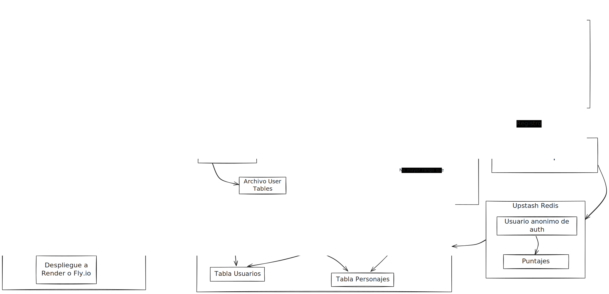

<div align="center">

# Trivia Simpsons ES latam 🍩

[](https://nodejs.org/)
[](https://www.npmjs.com/)
[](https://www.nodemon.io/)
[](https://www.npmjs.com/)
[](https://expressjs.com/)
[](https://eslint.org/)

[](https://docs.github.com/en/actions)
[](https://supabase.com/)
[](https://render.com/)
[](https://docker.com/)
[](https://sentry.com/)
[](https://grafana.com/)


</div>

<div align="center"></div>

<div align= "center" >

### Este proyecto es un trabajo universitario presentado en la materia DevOps de la universidad de palermo.

</div>

# 🤓 Objetivo

### Implementar diferentes herramientas en un proyecto que contemple el correcto funcionamiento del servicio, el cual sea alojado en la nube.

### Esto nos va a servir para poder controlar y verificar el funcionamiento del mismo asi como tambien analizar las metricas, los testeos, manejo de CI/CD, creacion y configuracion de archivos docker.

# 🔑 Acceso a la api - 

### Podes acceder a la api a traves del siguiente [link](https://simpsons-trivia.fly.dev/)

#### En la documentacion podras encontrar mas informacion sobre que rutas estan disponibles para consultar y/o realizar solicitudes.

# 🙋‍♂️ Preguntas y Respuestas

<details close><summary><h2>De que trata el proyecto? 🤔</h2></summary>

### El proyecto contempla la creacion de una trivia usando frases de los simpsons, la idea es adivinar la mayor cantidad de personajes en base a las frases brindadas en cada ronda.

### El mismo cuenta con una base de datos que almacena la informacion de los jugadores/participantes.

</details>

<details close><summary><h2>Que recursos se usaron? 🛠️</h2></summary>

### Se usaron diferentes herramientas las cuales son:

- **Servidor:** Node, Express, NPM, Axios

- **Local:** Nodemon, EsLint

- **Base de datos:** Supabase (Postgres)

- **Testing:** Jest

- **Host:** Render

- **Documentacion:** Swagger

</details>

<details close><summary><h2>Funcionalidades</h2></summary>

- [x] Consultar frases iconicas y famosas de la serie

- [x] Acceder a los diferentes endpoints

- [x] Consultar todos los personajes

- [x] Consultar que frase pertenece a que personaje

- [x] Consultar el estado de la api en health check

- [ ] Posibilidad de jugar, sumar puntos (ranking)

- [ ] Consultar a que capitulo/temporada pertenece la frase

</details>

<details close><summary><h2>Quienes participaron? 👨‍💻</h2></summary>

- #### Back end: Tomás Saint Romain

- #### Front end: 👀

</details>

# 📖 Documentacion

###### Por mas que parezca tentador por favor no se coma la documentacion 🤤

### Clonar el repositorio:

``` bash
git clone https://github.com/TomasS-R/SimpsonsTrivia
```

### Instalar los requerimientos:

``` bash 
npm install
```

### Correr el proyecto en local:
``` bash
nodemon --env-file=.env src/app.js
```
### O tambien puedes usar:
``` bash
npm run dev
```

## Variables de entorno 💡

<summary><h3>Base de datos</h3></summary>

> [!IMPORTANT]
> Al correr este proyecto puedes agregar las siguientes variables de entorno al archivo .env (debes crear este archivo, o cambiarle el nombre al archivo .env.template) ya sea que lo corras de forma local o en la nube ☁️ si completas los campos debes cambiar la variable `CONNECTPOSTGRES` y colocarla en `True` ya que si no, no tomara las variables de la Base de datos.

Variables de entorno para la conexion con postgress

| Nombre | Valor default | Descripcion |
| - | - | - |
| DATABASEUSER | - | Campo usuario de la base de datos |
| DATABASEPASS | Tu constraseña | La contraseña de la base de datos |
| DATABASEHOST| - | El host que te provee la base de datos|
| DATABASEPORT| - | El puerto que te provee|
| DATABASENAME| postgress | El nombre que te provee|

<summary><h3>Puerto</h3> <h5>(donde correra la aplicacion)</h5></summary>

> [!NOTE]
> Por defecto si no tiene valor correra en el puerto 3000

`PORT=`

<summary><h3>Host</h3> <h5>(donde se aloja la aplicacion)</h5></summary>

> [!NOTE]
> Por defecto tiene 'localhost:' debes cambiarlo al subirlo a la nube

`HOST`

<summary><h3>JWT</h3> <h5>(Seguridad login)</h5></summary>

> [!NOTE]
> JWT_SECRET es para generar un json web token este lo debes generar tu mismo, puedes combinar letras y numeros o usar un generador de contraseñas

`JWT_SECRET=`

<summary><h3>CONNECTPOSTGRES</h3></h3> <h5>(conexion a base de datos)</h5></summary>

> [!NOTE]
> Por defecto si no tiene valor asignado esta en `False`, en caso de haber cargado las variables colocarlo en `True`

`CONNECTPOSTGRES=`

<summary><h3>NODE_ENV</h3></h3> <h5>(estado de desarrollo)</h5></summary>

> [!NOTE]
> Dependiendo si se desplega en dev va a seguir por defecto en desarrollo, si no va a estar en produccion.

`NODE_ENV=`

<summary><h3>URLHOST</h3></h3> <h5>(la url donde esta tu proyecto alojado)</h5></summary>

> [!NOTE]
> En mi caso lo coloque en render por lo que estara apuntando a https://simpsons-trivia.onrender.com pero debes colocar el tuyo segun la url que te entregue el proveedor.

`URLHOST=`

<summary><h3>CORS_ORIGIN</h3></h3> <h5>(las urls que permitira CORS)</h5></summary>

> [!NOTE]
> Si no se ingresa ninguna url por default permitira todas las url´s, puedes colocar una o varias rutas de esta forma =https://www.url1.com,http://www.url2.com,http...

`CORS_ORIGIN=`

<summary><h3>SENTRY_DNS</h3></h3> <h5>(monitoreo mediante Sentry)</h5></summary>

> [!NOTE]
> Ingresa tu DSN de sentry si tienes y si quieres realizar un monitoreo de la api mas preciso, si no puedes dejarlo vacio!

`SENTRY_DSN=`

### Testing

Para realizar testing del proyecto ejecutar el siguiente comando:

``` bash 
npm test
```
Esto ejecutara los tests que se encuentran dentro de la carpeta tests.

## Dockerfile construccion 🐳
Para construir la imagen en modo desarrollo:
``` bash 
docker build -t my-trivia-node-app --target dev .
```
Para construir la imagen en modo producción:
``` bash 
docker build -t my-trivia-node-app --target prod .
```

### Ejecutar dockerfile 
``` bash 
docker run -p 3000:3000 my-trivia-node-app 
```
#### Si quieres que detecte las variables de entorno desde tu pc ejecuta
``` bash 
docker run --env-file .env -p 3000:3000 my-trivia-node-app 
```

Para construir el docker-compose para modo producción:
``` bash 
docker-compose up --build
```

## Ejecutar EsLint 👷‍♂️
#### Si quieres comprobar el estado del proyecto ejecuta el siguiente comando
``` bash 
npm run lint
```
#### El mismo mostrara los errores varios (si es que hay).

# 📚 Mucha mas Documentacion

```bash
📂 PROYECTO-DEVOPS
├── 📂.github
│   └── 📂 workflows                    # Contiene los archivos de CI/CD para GitHub Actions
│       ├── node.js.yml                 # Pipeline de CI y CD para la construccion, subida a docker hub y el deploy en render
│       └── release.yml                 # Archvio que se encarga de hacer un release automatico en github
│
├── 📂 media                            # Contiene imagenes para el readme
├── 📂 src                              # Contiene el código fuente de la aplicación
│   ├── app.py                          # Archivo de arranque del proyecto
│   ├── 📂 account                      # Contiene el manejo de cuentas de los usuarios
│   │   ├── 📂 roles                    # Contiene los archivos que manejan los roles
│   │   │   ├── roleMiddleware.js       # Intermediario en controlar y verificar los roles y accesos
│   │   │   └── rolesManager.js         # Clase donde se manejan la jerarquia y cada tipo de rol
│   │   │
│   │   ├── login.js                    # Archvio para iniciar sesion y administrar tokens
│   │   ├── passportConfig.js           # Validacion de credenciales del login
│   │   └── register.js                 # Archivo que registra a los usuarios y valida los campos
│   │   
│   ├── 📂 controllers                  # Contiene archivos de controladores
│   │   └── triviaControllers.js        # Archvio que es intermediario entre routes y queries
│   │   
│   ├── 📂 dbFiles                      # Contiene archvios de la base de datos
│   │   ├── 📂 creatingTables           # Contiene archivos de la creacion de las tablas automaticas
│   │   │   └── userTables.js           # Nombres de tablas y campos de cada una
│   │   │
│   │   ├── 📂 monitoring               # Contiene los archvios correspondientes al monitoreo de la api
│   │   │   └── sentryConfig.js         # Configuracion para la conexion con Sentry
│   │   │
│   │   ├── databaseManager.js          # Archivo que se encarga de realizar la conexion a pg al iniciar
│   │   └── queries.js                  # Archvio que realiza las consultas a la BD
│   │   
│   ├── 📂 routes                       # Contiene los archvos que manejan las rutas
│   │   ├── apiRoutesDoc.yaml           # Explica como comunicarse con cada ruta
│   │   ├── routes.js                   # Todas las rutas del proyecto
│   │   ├── securityRoutes.js           # Maneja la seguridad de las rutas
│   │   └── swaggerDocs.js              # Se encarga de la interfaz de apiRoutesDoc.yaml
│   │   
│   └── 📂 scrapQuotes                  # Contiene los archivos de las frases
│       ├── characters_simpsons.csv     # Tiene los personajes de la serie animada
│       └── quotes_simspons.csv         # Se encuentran las frases de la serie y su numero de personaje
│
├── 📂 tests                            # Contiene todos los tests
│   └── queries.test.js                 # Archivo que tiene y realiza los tests del proyecto
│
├── .env.template                       # Plantilla para las variables de entorno
├── .gitignore                          # Archvios que no se suben a github
├── changelog.md                        # Cambios que se realizan en cada version
├── docker-compose.yml                  # Configuración de Docker Compose
├── Dockerfile                          # Archivo Docker para construir la imagen de la api
├── eslint.config.mjs                   # Configuracion de la dependencia EsLint
├── fly.toml                            # Configuracion para deploy en Fly.io
├── license.txt                         # Archivo de licencia del proyecto
│
├── 📂 package.json                     # Contiene las dependencias del proyecto y + configuraciones
│   └── package-lock.json               # Maneja las dependencias
│
└── readme.md                           # Instrucciones principales de la api y usos
```

<div align= "center" >

<div align="center"></div>

</div>

#### En este archivo podras encontrar todo el instructivo relaccionado al proyecto en si.

#### Para mas info del proyecto y comprender mejor el codigo dirigirse a la documantacion correspondiente -> (proximamente)

# 🤩 Te gusto el proyecto?

#### Regalame una estrella ⭐ es gratis!

#### Me agradaria saber que te gusto y ademas asi sabre que el proyecto te sirvio y fue de utilidad para ti!

# 🎬 Creditos

#### Las frases y la info para crear este proyecto fueron obtenidas gracias a la [wiki de los simpsons](https://simpsons.fandom.com/es/wiki/Simpson_Wiki_en_Espa%C3%B1ol:Portada)

# 📝 Licencia

#### Este proyecto está bajo licencia. Consulte el archivo [Licencia](license.txt) para más detalles.